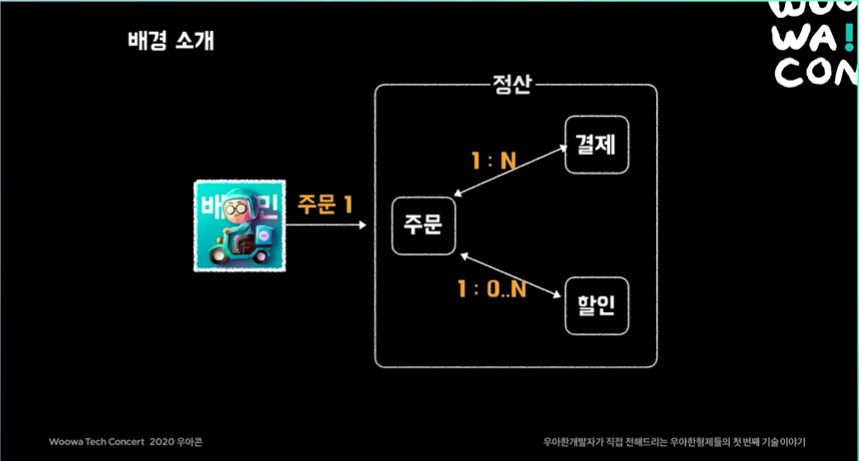
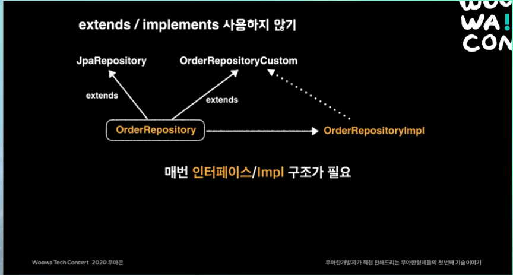
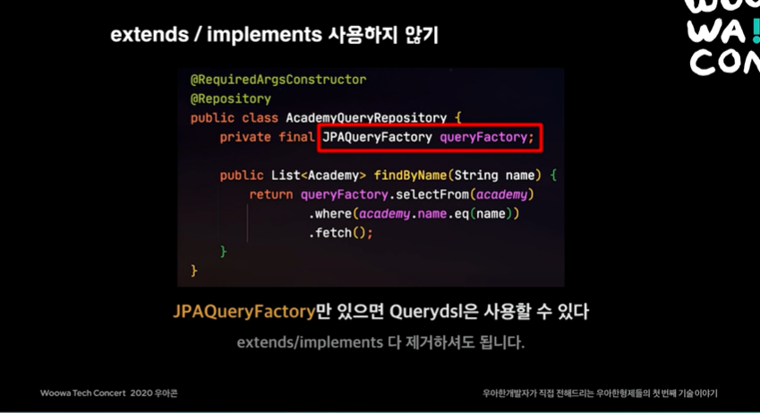
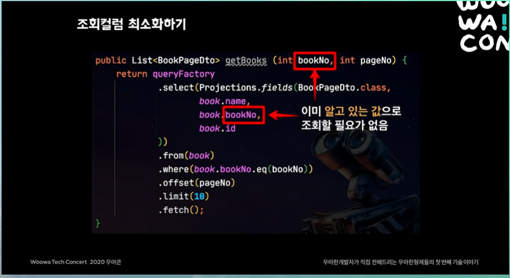
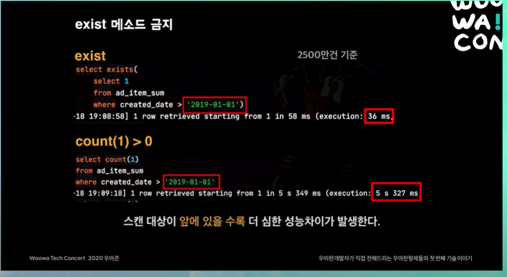
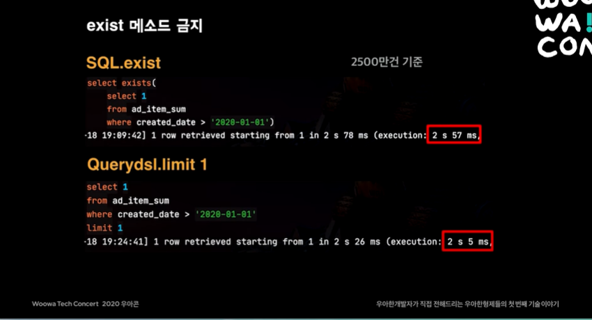
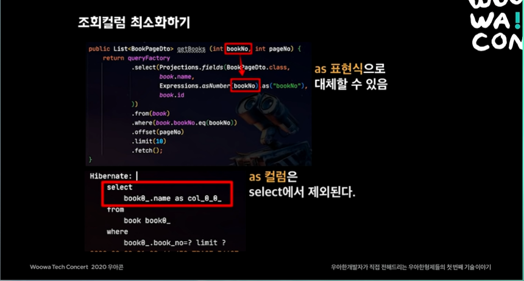
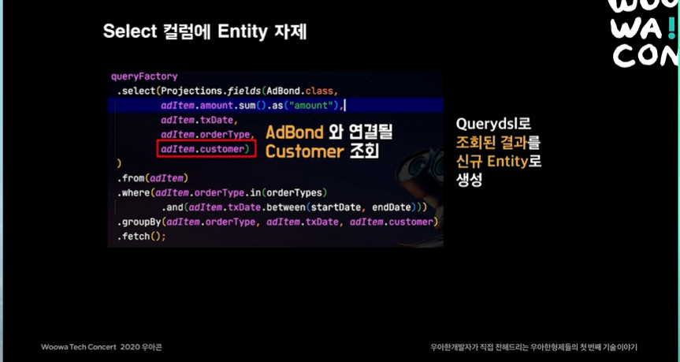
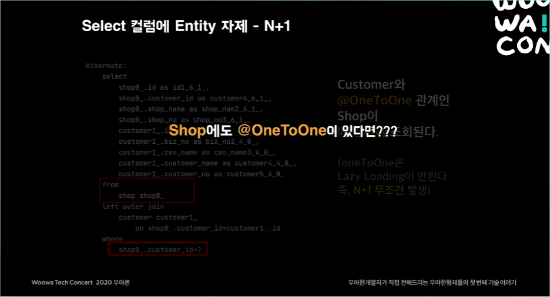
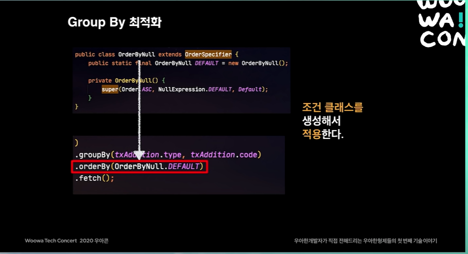

# queydsl 사용 배경
배달의 민족 어플을 통해 1개의 주문을 발생시킬 경우 정산시스템 DB에는 총 3개의 테이블이 작동한다.

- 1개의 주문정보와 N개의 결제 정보가 존재한다.
- 0개에서 N개의 할인정보가 매핑된다.



이때 주문과 결제 테이블에는 10억개에서 13억개의 쿼리가 발생한다.
이렇듯 적재된 데이터가 1000만건에서 10억건까지 아주 큰 수를 차지하고 있을 때,  querydsl을 개선하여 사용하는방법에 대해 다루게 되었다.

[목차]
-
- 워밍업
- 성능개선 - select
- 성능개선 - update/insert
- 마무리

## 1. extends/implements 사용하지 않기(워밍업)

첫번째 효율성을 높이기 위한 방법으로는 상속과 구현을 사용하지않는다. 



보통적으로 querydsl을 사용하기 위해선 JPARepository를 상속받고 CustomRepository를만들어
Interface를 extends하고 Impl을 만들어 사용하는 방식을 선호한다.

하지만, 이에 따라 하나의 Entity에 생겨나는 객체가 최소 2개이며 불필요한 상속과 확장을 남용하게 된다.

이에 과함을 느끼고 QuerydslSuport를 상속받는 구조체를 만들어 사용할 수 있지만,
매번 Support을 상속하고 super 생성자에 Entity를 등록해야한다는 번거로움이 존재한다.

그럼 여기서 우리는 한가지 생각을 할 수 있다.
> 꼭 무언가를 **상속/구현** 받지 않더라도, 꼭 **특정 Entity를** 지정하지 않더라도 querydsl을 사용할 수 있는 방법은 없을까?

이를 충족하는 방법은 JPAQueryFactory를 사용하여 querydsl을 사용하는데 문제가 없게 만들 수 있다.
상속/구현 구조를 탈피할 수 있다.

**QueryDsl사용방법**
```java
// 기존 방법 1. 
public interface MemberRepository extends JpaRepository<Member, Long>, MemberRepositoryCustom {} 


// 기존 방법2
public class MemberRepositoryCustom extends QuerydslRepositorySupport {}

// 추천하는 방법
@Repository
@RequiredArgsConstructor 
public class MemberRepositoryCustom {
    private final JpaQueryFactory queryFactory; // 물론 이를 위해서는 빈으로 등록을 해줘야 한다. 
}
```

**JpaQueryFactory 빈으로 등록하는 방법**
```java
@Configuration
public class QuerydslConfiguration {
    @Autowired
    EntityManager em;

    @Bean
    public JPAQueryFactory jpaQueryFactory() {
       return new JPAQueryFactory(em);
    }
}
```



## 2. 동적쿼리(워밍업)

동적쿼리를 작성하는 방법에는 BooleanBuilder 를 작성하는 방법과 Where 절과 피라미터로 Predicate 를 이용하는 방법 그리고 Where 절과 피라미터로 Predicate 를 상속한 BooleanExpression 을 사용하는 방법 이렇게 있다.

예제를 보면 알겠지만 BooleanBuilder 를 사용하는 방법은 어떤 쿼리가 나가는지 예측하기 힘들다는 단점이 있다.

그리고 Predicate 보다는 BooleanExpression 을 사용하는 이유로는 BooleanExpression 은 and 와 or 같은 메소드들을 이용해서
BooleanExpression 을 조합해서 새로운 BooleanExpression 을 만들 수 있다는 장점이 있다.

그러므로 재사용성이 높다. 그리고 BooleanExpression 은 null 을 반환하게 되면 Where 절에서 조건이 무시되기 때문에 안전하다.

대부분 동적 쿼리의 사용을 위해 BooleanBuilder를 대부분 사용하고 기능적으로 문제는 없다.
하지만 어떤 쿼리인지 예상하기 어렵다.

**BooleanBuilder 를 이용하는 예제**

```java
public List<MemberTeamDto> searchByBuilder(MemberSearchCondition condition){
    BooleanBuilder builder = new BooleanBuilder();

    if (hasText(condition.getUsername())) {
        builder.and(member.username.eq(condition.getUsername()));
    }

    if(hasText(condition.getTeamName())){
        builder.and(team.name.eq(condition.getTeamName()));
    }

    if(condition.getAgeGoe() != null) {
        builder.and(member.age.goe(condition.getAgeGoe()));
    }

    if(condition.getAgeLoe() != null){
        builder.and(member.age.loe(condition.getAgeLoe()));
    }

    return queryFactory
            .select(new QMemberTeamDto(
                    member.id.as("memberId"),
                    member.username,
                    member.age,
                    team.id.as("teamId"),
                    team.name.as("teamName")
            ))
            .from(member)
            .leftJoin(member.team, team)
            .where(builder)
            .fetch();
}
```
**Where 절과 BooleanExpression 을 이용하는 에제**
```java
public List<MemberTeamDto> searchByWhere(MemberSearchCondition condition){
    return queryFactory
            .select(new QMemberTeamDto(
                    member.id.as("memberId"),
                    member.username,
                    member.age,
                    team.id.as("teamId"),
                    team.name.as("teamName")
            ))
            .from(member)
            .leftJoin(member.team, team)
            .where(
                usernameEq(condition.getUsername()),
                teamNameEq(condition.getTeamName()),
                ageGoe(condition.getAgeGoe()),
                ageLoe(condition.getAgeLoe())
            )
            .fetch();
}

private BooleanExpression usernameEq(String username) {
    return hasText(username) ? member.username.eq(username) : null;
}

private BooleanExpression teamNameEq(String teamName) {
    return hasText(teamName) ? team.name.eq(teamName) : null;
}

private BooleanExpression ageGoe(Integer ageGoe) {
    return ageGoe != null ? member.age.goe(ageGoe) : null;
}

private BooleanExpression ageLoe(Integer ageLoe) {
    return ageLoe != null ? member.age.loe(ageLoe) : null;
}

private BooleanExpression ageBetween(Integer ageLoe, Integer ageGoe) {
    return ageLoe(ageLoe).and(ageGoe(ageGoe));
}
```



이를 보완하기 위해 BooleanExpression을 이용한다.
메서드 단위로 만들어 null을 반환할 경우 자동으로 조건절에서 제거된다.

모든 조건에 null이 반환되는 경우에는 서버에 대대적인 에러가 발생한다.

## 성능개선 - Select (Main.1)

### querydsl에서의 exist 금지(select 성능개선하기) (Main.1-1)

exist는 서브쿼리의 값의 유무만을 판단하는 메소드로 만약 한건이라도 있다면 쿼리를 중지하게 된다.


**예시**


2500만건을 기준으로 SQL 쿼리에서 exist와 count 쿼리를 비교한 것이다.

exist를 사용하면 시간이 count에 비해 50%의 뛰어난 성능을 보이는 것을 볼 수 있다.
이는 exist가 특정 조건을 만족하는 row의 유무를 판단하는 능력이 더 뛰어나기 때문이다.

더 뛰어나다는 것은 exist의 경우 앞서말했듯이 한건을 찾는 순간 바로 중지되기 떄문에 더 빠른속도를 보장한다.

하지만 이는 찾고자 하는(스캔 대상)의 데이터 위치에 따라 성능의 차이가 심하게 차이나게 된다.

count의 경우 모든 데이터를 조회하며 조건에 부합하는 row만을 색출하는 반면
exist는 발견할 때 까지 조회 작업을 수행하기에 데이터의 위치에 따라 성능이 차이난다.




또한, querydsl의 exist는 실제로 sql의 exist가 아닌 count를 토대로 구현이 되어있기 때문에 앞서 성능상으로 문제가 되었던 count를 이용하는 만큼
성능이 좋지 못하게 된다.

**Querydsl 내부 exists 구현 상태 - QuerydslJpaPredicateExecutor.class**

```java
public boolean exists(Predicate predicate) {
    return this.createQuery(predicate).fetchCount() > 0L; // 보시다시피 count 로 조회한다.
}
```

또한 sql의 근간이 되는 조회작업시 from절 없이는 조회작업이 수행될 수 없는 이슈 또한 존재하기에
exist 사용을 지양해야한다.

**exist가 빠른 이유는?**
조건에 해당하는 row 1개만 찾으면 바로 쿼리를 종료하기 때문이다.
하지만, 사용이 불가능한 이슈가 존재한다.
그렇다면? `직접 구현`하여 사용하자

### exist 직접구현하기 (Main.1-2)

exist를 직접구현하는데 있어 가장 쉬운 방법은 limit 1로 조회작업을 진행한다.

```java
@Transactional(readOnly=true)
public Boolean exist(Long entity_seq){
    Integer fetchOne = queryFactory
        .selectOne()
        .from(entity)
        .where(entity.seq.eq.(entity_seq))
        .fetchFirst();
    
    return fetchOne != null; //조회 결과가 존재하지 않을 경우 null이 반환되기에 체크작업을 수행
}
```

위의 코드에서 fetchFirst를 사용하는 것은 `fetchFirst()`가 `limit(1).fetchOne()`을 보장하기 때문이다.

## 직접 구현 결과



원래 사용하던 exist보다 조금 더 개선된 성능을 보여주는 것을 볼 수 있다.


### Cross Join 회피하기(select 성능개선하기) (Main.1-3)

Join시 CrossJoin(상호조인)을 사용하면 당연히 속도적인 측면의 성능상 이점을 가지진 않는다.
CrossJoin의 경우 나올 수 있는 모든 경우의 수를 대상으로 하기 때문이다.

이때 join을 사용하지 않더라도 묵시적 Join으로 Cross Join이 발생한다. 

ex) 만약 Customer라는 Entity 내부에 Shop이라는 Entity가 Relation Mapping이 되어있고 이를 where 절에서 사용할 경우 묵시적 Join이 발생한다.

이러한 이슈는 querydsl이 아니더라도 Native Query 또는 Spring Data Jpa에서도 동일 이슈가 발생한다.(Hibernate 이슈이기 때문)

> 💡 묵시적 조인
>
> from절에서 조인 관계를 따로 명시하진 않는다. select절에서 의존성을 가지는 다른 엔티티 객체를 조회하려 할 경우 JPA가 알아서 PK, FK를 가지고 해당 테이블과 inner join을 수행하는 쿼리를 날려준다.
>
> 당연한 이야기지만 묵시적 조인에서는 inner join만 가능하다. outter join을 하려면 만드시 명시적 조인을 사용해야 한다

### Cross Join을 회피하는 방법(Main.1-4)

정말 간단하게 이슈를 해결할 수 있는데 join을 명시적으로 선언하지 않아 묵시적 조인이 발생하고 이때 Cross Join이 발생한다.
그렇다면 이를 해결하기 위해 innerJoin을 명시적으로 작성해줄 경우 Cross Join이 발생하지 않을 뿐더러 Entity 하나에만 Join이 발생하게 된다.


### Entity 보다는 DTO를 우선시(select 성능개선하기) (Main.1-5)

JPA의 환경에서 Entity는 당연히 중요한 가치를 가지지만 DB와 직접 연결되는 객체인 만큼 수정 및 삽입의 작업에 신중해야한다.

이를 DTO를 사용하여 Entity 자체의 부담을 덜 수 있는 방법이 존재한다.

quertdsl에서 Entity를 조회하게 경우 크게 3가지 문제가 존재한다.

1. Hibernate 1차, 2차 캐시 이슈
2. 불필요한 컬럼 조회
3. OneToOne Relation 시 N+1 쿼리 발생

### 🤔 왜 DTO를 조회해야할까?

**Entity 조회 Case**
- 실시간으로 Entity 변경이 필요한 경우

**DTO 조회**
- 고강도 성능 개선 or 대량의 데이터 조회가 필요한 경우

즉, 직접적으로 Entity에 상태변화를 일으키는 로직이 아닐 경우(조회 작업에 한할 경우) DTO를 조회하는 것이 성능적으로 이점이 존재한다.

### 조회 컬럼 최소화 하기(Main.1-6)

**이미 알고 있는 값(ex. 인자값으로 넘어 온값 또는 전역으로 사용되는 값)**을 조회 쿼리에 포함시키지 않는다.


위의 예제 사진을 본다면 이미 선언된 값을 조회 쿼리에 포함시켜 불필요한 조회 작업이 한번 더 이루어지게 된다.

하지만 해당 필드 값을 토대로 조회작업은 결국에 select 절에는 포함이 되어야한다. 

**이를 어떻게 대체할 수 있는가?**

조회 절에 `as 표현식`을 사용하여 대체할 수 있다.(Expression을 사용하여 boolean 값으로 return 받아 사용하게 된다면, 불필요한 컬럼을 줄일 수 있다.)



### Select 컬럼에 Entity 자제하기(Main.1-7)



위 예제 사진과 같이, Owner Entity(select의 주인이 되는 Entity)를 Select 하게되면 
Target Entity(연관 관계가 맺어져 조회시 필요한 엔티티)를 필드값으로 조회할 때, 조회된 결과를 바탕으로 신규 Entity를 생성하게된다.

하지만 이경우 Target Entity의 모든 필드값이 조회 되게 된다. 

예를 들어 Target Entity의 PK만을 필요로 할 경우, 이 외의 필드 값 또한 조회되기 때문에 불필요한 컬럼이 조회된다.

여기서 앞서 말한 `@OneToOne` 매핑 관계일 경우의 이슈가 발생하게된다.

### @OneToOne 이슈?(Main.1-7-1)
@OneToOne은 JPA에서 사용하는 로딩전략 기법중 `LAZY Loading` 전략이 적용되지 않는다.

그렇기 때문에 조회시점에서 영속성 컨텍스트에 의해 1:1로 매핑된 Entity의 모든 필드 값을 또 조회한다.

그럼 우리는 여기서 최악의 경우를 상정해 볼 수 있다.

**현재 `@OneToOne` 매핑으로 인해 불러와지는 Entity 또한 다른 Entity와 @OneToOne으로 매핑되어있다면?**

또 다시 해당 엔티티 전부를 가져오게 되므로 불필요한 조회가 수도 없이 일어날 수 있다.




### Entity 자제시 저장에 대한 고민(Main.1-7-2)

**🤔 Entity간의 연관관계를 맺기 위해선 Entity가 필요한 것아닌가?**
필자 또한 이 생각을 가장 먼저하게 되었다.

하지만 연관된 Entity의 save를 위해선 반대편 Entity의 PK, 즉 ID만 존재하면된다.

한마디로 Join column에 들어갈 ID만 필요한것이다.

내부적으로는 이 과정이 Entity의 나머지 column값을 distinct 시켜버린다.

## Main.1 Reference

### Hibernate 캐시 이슈

Hibernate는 영속성 컨텍스트를 기반으로 엔티티 객체의 상태를 추적하고 캐싱한다.
만약 동일한 엔티티를 조회하거나 수정하려고 할 때, 이전에 조회한 엔티티 객체가 영속성 컨텍스트에 캐싱되어 있다면, 새로운 쿼리를 실행하지 않고 
캐시된 객체를 반환하며, Hibernate 캐시의 기본 동작 방식이다

그러나 querydsl에서는 JPQL과 다르게 엔티티 객체를 직접적으로 조회한다.
이 경우, Hibernate는 영속성 컨텍스트를 우회하고 데이터베이스에서 직접 객체를 조회하게된다.
때문에, 이전에 캐시된 엔티티 객체가 최신 데이터베이스 상태와 일치하지 않을 수 있다.

따라서 DTO를 사용해야한다.

### 왜 DTO를 사용해야하는가?

**1. 필요한 필드만 선택할 수 있음**

- DTO를 사용하면 엔티티의 모든 필드를 가져오는 대신 필요한 필드만 선택하여 조회할 수 있다. 
- 이렇게 하면 데이터베이스에서 불필요한 데이터를 가져오지 않아 네트워크 대역폭과 데이터베이스 부하를 줄일 수 있는 장점이 존재.

**2. 쿼리 결과를 명확하게 정의할 수 있음**

- DTO는 쿼리 결과를 명확하게 정의할 수 있다. 엔티티를 직접 조회할 때는 쿼리 결과가 엔티티와 관련된 모든 필드를 반환한다.
- 하지만, 이는 의도하지 않은 데이터 노출을 초래할 수 있고 불필요한 데이터 또한 가져올 수 있다.
- DTO를 사용하면 쿼리 결과를 명확하게 정의하여 의도한 필드만 반환하도록 할 수 있다.

**3. 엔티티 변경에 대한 영향을 줄일 수 있음**

- DTO를 사용하면 엔티티를 변경하더라도 DTO에 영향을 주지 않는다.
- 엔티티를 변경하면 데이터베이스에서 가져오는 모든 쿼리의 결과에 영향을 줄 수 있지만 DTO를 사용하는 경우 DTO를 Entity화 시키는 부분만 수정하여 주면 된다. 
- DTO를 사용하면 데이터베이스에서 가져오는 쿼리의 결과에만 영향을 주기 때문에 엔티티 변경에 따른 영향을 줄일 수 있다.

**4. 성능 개선을 위한 추가적인 작업 가능**

- DTO를 사용하면 성능 개선을 위해 추가적인 작업을 할 수 있다. 예를 들어, DTO에서 사용하지 않는 필드를 제거하여 데이터베이스 쿼리의 성능을 개선하거나,
DTO에 대한 캐시를 적용하여 성능을 향상시킬 수 있다.

### GroupBy를 통한 최적화 (Main.1-8)
Mysql 환경(MariaDB)에서 GroupBy 실행시 반드시 Filesort가 발생한다.(해당 쿼리가 index를 타지 않았을경우)

이를 해결하기 위해 `order by`절에 null을 사용하면 FileSort 시간을 제거하여 최적화 작업을 수행할 수 있는데, queryDsl은 아쉽게도 order by null이 지원되지 않는다.

하지만 order by null을 직접 코드로 구현하여 사용한다면 queryDsl에서도 이용할 수 있다.

**조건 클래스 작성 예시**


### 만약 정렬 작업이 필요할 경우? (Main. 1-8-1)
정렬 작업이 필요한 데이터인 경우 조회 결과가 100건 이하라면, DB보다는 Was가 여유가 있는 편이기에 애플리케이션에서 정렬하는 것을 추천한다.

단, 페이징의 경우 order by null을 사용할 수 없다.


### 커버링 인덱스 (Main.1-9)

커버링 인덱스라는 용어는 필자의 경우 처음 접하게되었다.

> 💡 커버링 인덱스(Covering Index)
> 
> 쿼리를 충족하는데 필요한 모든 컬럼을 갖고 있는 인덱스를 뜻한다.
> 
> select/where/order by/group by 등에서 사용되는 모든 컬럼이 인덱스에 포함된 상태를 뜻한다.
> 
> NoOffset 방식과 더불어 페이징 조회 성능을 향상시키는 보편적인 방법

커버링 인덱스를 queryDsl에서 사용하기 위해선 PK를 커버링 인덱스로 빠르게 조회한뒤, 조회된 Key로 Select 컬럼을 조회한다.

## 성능개선 update/insert (Main.2)

### 일괄 update 최적화(Main.2-1)
기존에 Entity의 필드값을 수정하기 위해선 `DirtyChecking`을 많이 사용한다.

* DirtyChecking
  - Transaction 내부에서 Entity를 조회하여, 해당 Entity의 값을 변경하여 DB에 반영하는 것을 말한다.

우리는 이 과정에서 객체 지향을 핑계로 성능을 버리지 않는지, **무분별한 DirtyChecking**을 꼭 확인해봐야한다.

### 일괄 Update의 단점 (Main.2-1-1)
하이버네이트 캐시(1차,2차 캐시)가 일괄 업데이트 시에 일괄 업데이트 시에 캐시 갱신이 안된다.

해당 경우 업데이트 대상들에 대한 `Cache Eviction`이 필요로된다.

그래서 총 2가지 Case로 분류를 할 수 있게된다.

- DirtyChecking : 실시간 비즈니스 처리, 실시간 단건 처리
- Querydsl.update : 대량의 데이터를 일괄로 Update 처리

또한 진짜 Entity가 필요한것이 아니라면, queryDsl과 DTO를 통해, 딱 필요한 항목들과 조회하고 업데이트한다.

### Bulk Insert(Main.2-2)
JPA의 경우 PK가 AI일 경우 Bulk Insert가 적용되지 않는다.
