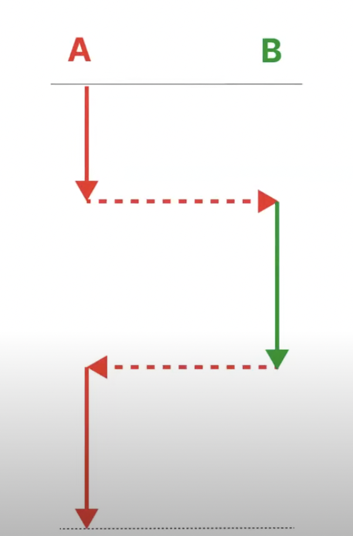
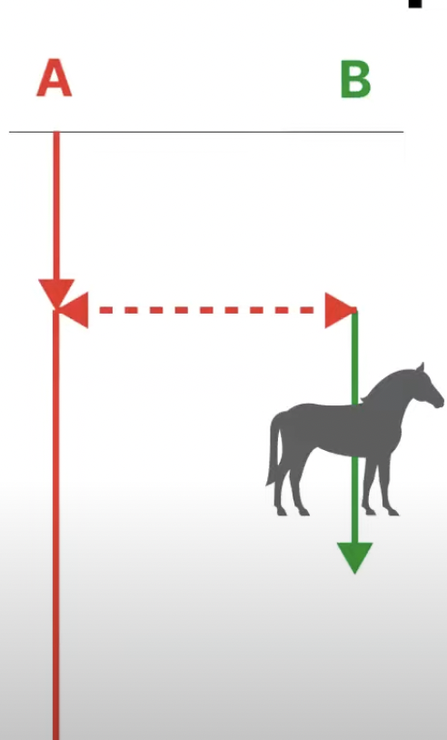

해당 용어들에 공통적으로 적용되는 개념은 바로, CPU는 소모되지는 않지만 그 용량은 한정적이다는 것이다.

그렇기에 CPU를 가장 효율적으로 쓰려면, 최대한 많이 사용하는 것이 우선이다. 한정적인 자원을 최대치의 효율적으로 사용하여 성능을 향상을 기대할 수 있다.

## Sync vs Async
- 기본적으로 동기처리 vs 비동기처리에 대한 논점이다.
- 가장 쉽게 이를 구분하는 것은 `동기`는 특성상 작업이 일괄적으로 시작하여 같은 지점에서 종료된다.
- 반면에 `비동기`의 경우 작업의 시작 지점과 종료 지점이 다르다.

- Sync 사용이유 
  - 작업의 시작, 종료 시점을 관리하기 위해
  - 작업 중에 다른 작업을 수행하지 못하도록한다.

- ASync 사용이유 
  - 시작, 종료 시점에 구애받지않는 로직을 작성하기 위해

## Blocking vs Non-Blocking
- 기본적으로 다른 작업의 실행이 현재의 작업 실행을 저지하는가의 여부
- `Blocking`은 다른 작업의 실행이 현재 작업에 영향을 끼쳐 실행되지 못함
- `Non-Blocing`은 다른 작업의 실행이 현재 작업에 영향 X
- 두 개념의 목적은 **제어할 수 없는 대상의 제어 방법을 정의하기 위함**이다.
  - 제어할 수 없는 대상 : 실행한 작업
  - 제어방법 : 대상이 제어권 빼앗을 것인가 또는 제어권을 얻을 것인로 구분

- 
  - 위와 같은 상황을 **A가 제어할 수 없는 대상인 B가 제어권을 빼앗았다**라고 표현 (Blocking)

- 
  - 위와 같은 상황을 **A가 제어할 수 없는 대상인 B가 제어권을 받았다**라고 표현 (Non-Blocking)

## 선택의 기준
- Non-Block + 비동기가 가장 좋은 방법인가?
  - 시간당 처리량을 기준으로 하였을 때 가장 좋은 방법일 수도 있다.
  - 하지만, 블로킹 + 동기를 멀티 쓰레드로 구현할 경우 비슷한 성능을 낼 수 있다.
    - 이 경우에는 쓰레드에 대한 별도의 관리 비용이 들어간다.
    - 또한, 오버헤드를 고려해야하는 사항도 생긴다.
      - 만약, 오래걸리는 작업의 경우? 쓰레드가 처리하는데 있어 오버헤드가 크지 않다.
      - 하지만, 짧게 끝나는 작업이 여러개일 경우 => 쓰레드가 많이 할당되며 오버헤드가 많다.

- 또한 개발자에게는 성능만 비용(cost)로 치부할 수 있나?
  - 그렇지 않다. 개발자들의 인지 비용 또한 cost로 쳐야한다.
  - 동기 + 블로킹의 경우 직관적이다 -> 순차적 처리
  - 비동기 + 논블로킹의 경우 직관적이지는 않기에 코드해석 및 순서처리 고민